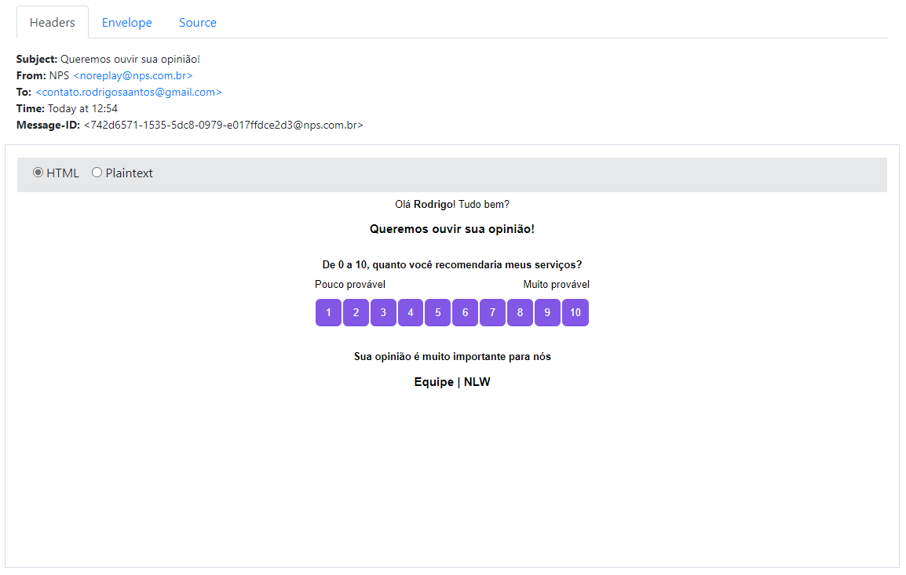

<h2 align="center">
  
</h2>

<h1 align="center">
    NPS - Net Promoter Score | NLW#4
</h1>

<div align="center">

  <a href="">
    
  </a>

  <a href="">
    
  </a>

  <a href="">
    
  </a>

  <a href="">
    
  </a>
  
</div>

<p align="center"> Application developed in the fourth edition of Rocketseat Next Level Week 💻🚀 </p>

<p align="center">
 <a href="#objective">Objective</a> •
 <a href="#technologies">Technologies</a> • 
 <a href="#usage">Usage</a> • 
 <a href="#contribution">Contribution</a> • 
 <a href="#author">Author</a> • 
 <a href="#demo">Demo</a> • 
 <a href="#license">License</a>
</p>

<h1 align="center">
  
</h1>

<h4 align="center"> 
	📩 NPS | NLW#4 ⏰📈 Loading...  📩
</h4>

<h2 id="objective" > 🎯 Objective </h2>

Net Promoter Score is the percentage of customers rating their likelihood to recommend a company, a product, or a service to a friend or colleague as 9 or 10 minus the percentage rating this at 6 or below on a scale from 0 to 10..

<h2 id="technologies"> 🛠 Technologies </h2>

The following tools were used in the construction of the project:

- [NodeJS](https://nodejs.org/en/)
- [Yarn](https://yarnpkg.com) or Npm
- [VSCode](https://code.visualstudio.com)
- [Git Bash](https://gitforwindows.org/)
- [Typescript](https://www.typescriptlang.org/)
- [TypeORM](https://typeorm.io/#/)
- [Sqlite](https://www.sqlite.org/index.html)
- [Jest](https://jestjs.io/)
- [Nodemailer](https://nodemailer.com/about/)
- [Ethereal](https://ethereal.email/)
- [Handlebars](https://handlebarsjs.com/)
- [Yup](https://github.com/jquense/yup)

<h2 id="usage" > 👷 Usage </h2>

Rename files "**ormconfig.example.json**", "**.env.example**" to **ormconfig.json**, "**.env**"

Required! Install git, node and yarn (or npm).

```bash
# Clone Repository
$ git clone https://github.com/RodrigoSaantos/nlw4-net-promoter-score.git

# Go to server folder
$ cd nlw4-net-promoter-score

# Install Dependencies
$ yarn
# or
$ npm install

# Run Aplication
$ yarn dev:server
# or
$ npm run dev:server

# Access localhost
http://localhost:3333
```

<h2 id="contribution"> 🤝 Contribution </h2>

This project is for study purposes too. All kinds of contributions are very welcome and appreciated!

- Fork this repository;
- Create a branch with your feature: `git checkout -b my-feature`;
- Commit your changes: `git commit -m 'feat: My new feature'`;
- Push to your branch: `git push origin my-feature`.

<h2 id="author"> 💻 Author </h2>


By Rodrigo Santos 👋🏽 Find me:

[](https://www.linkedin.com/in/rodrigo-dos-santos-silva-637225156/) 
| 
[](mailto:contato.rodrigosaantos@gmail.com)

<h2 id="demo"> 🎌 Demo </h2>

<h1 align="center">
  <div style="display: flex; flex-direction: row;">
    
  <div>
</h1>

<h2 id="license"> 📝 License </h2>

This project is under the MIT license.